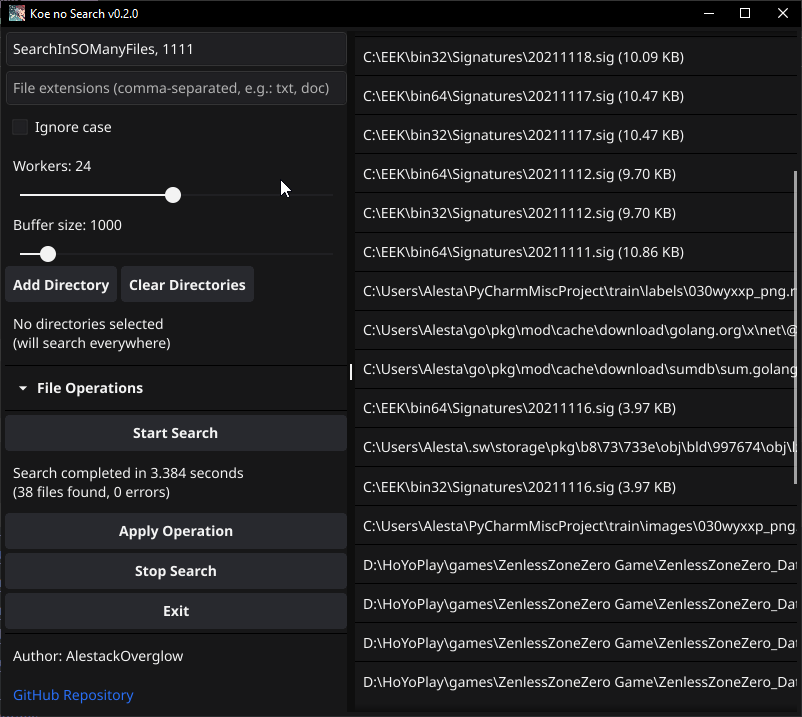

# Koe no Search
<p align="center">
  
</p>

<div align="center">

> 🔍 Lightning-fast file search utility with modern GUI and CLI interfaces, designed for efficiency and ease of use.

[](https://golang.org/dl/)
[](LICENSE)
[]()

</div>

## Table of Contents
- [Quick Start](#quick-start)
- [Key Features](#-key-features)
- [Why Koe no Search?](#-why-koe-no-search)
- [System Requirements](#-system-requirements)
  - [Minimum Requirements](#minimum-requirements)
  - [Recommended](#recommended)
- [Installation](#-installation)
  - [Prerequisites](#prerequisites)
  - [GUI Build Requirements](#gui-build-requirements)
  - [Building from Source](#building-from-source)
- [Usage Examples](#-usage-examples)
  - [GUI Interface](#gui-interface)
  - [CLI Interface](#cli-interface)
- [API Documentation](#-api-documentation)
- [Technical Details](#-technical-details)
  - [Performance Optimizations](#performance-optimizations)
- [Contributing](#-contributing)
- [License](#-license)
- [Acknowledgments](#-acknowledgments)

## Quick Start

1. Download the latest release for your platform
2. Run the executable:
   - GUI version: `koe-no-search-gui`
   - CLI version: `koe-no-search-cli -p "*.txt" /path/to/search`
3. Start searching!


## ✨ Key Features

- 🔍 Instant search without indexing
- 🖥️ Modern, intuitive GUI
- ⌨️ Powerful CLI interface
- 🚄 High-performance concurrent search
- 💻 Cross-platform support
- 🛠️ Built-in file operations
- 📊 Real-time progress tracking
- ⚡ Memory-mapped file handling
- 🎯 Pattern and extension filtering
- 🔄 Real-time results updates

## 🆚 Why Koe no Search?

### Comparison with Other File Search Tools

| Feature                    | Koe no Search | Everything | Agent Ransack | Windows Search |
|---------------------------|---------------|------------|---------------|----------------|
| GUI Interface             | ✅            | ✅         | ✅            | ✅             |
| CLI Interface             | ✅            | ❌         | ❌            | ❌             |
| Cross-Platform           | ✅            | ❌         | ❌            | ❌             |
| Memory-Mapped Files      | ✅            | ✅         | ❌            | ❌             |
| Real-Time Results        | ✅            | ✅         | ✅            | ✅             |
| File Operations          | ✅            | ❌         | ✅            | ✅             |
| Regex Support            | ✅            | ❌         | ✅            | ❌             |
| No Indexing Required     | ✅            | ✅         | ✅            | ❌             |
| Open Source              | ✅            | ❌         | ❌            | ❌             |
| Configurable Workers     | ✅            | ❌         | ❌            | ❌             |
| Progress Tracking        | ✅            | ✅         | ✅            | ❌             |
| Search Time Display      | ✅            | ❌         | ✅            | ❌             |
| Search Speed (1M files)* | ~4s          | ~3s        | ~15s         | ~30s           |
| No Admin Required        | ✅            | ❌         | ✅            | ✅             |
| No Background Service    | ✅            | ❌         | ✅            | ❌             |
| Portable                 | ✅            | ✅         | ❌            | ❌             |

\* Search speed measured on Windows 10, Intel i5, 16GB RAM, SSD, searching through 1 million files (mixed sizes) in system directories. First search after system startup, no indexing.

## 🔧 System Requirements

### Minimum Requirements
- RAM: 256MB
- CPU: Dual-core processor
- Disk Space: 40MB
- OS: Windows 7+, Ubuntu 18.04+, macOS 10.13+

### Recommended
- RAM: 1GB+
- CPU: Quad-core processor
- SSD Storage
- OS: Latest version of your platform

## 📦 Installation

### Prerequisites
- Go 1.21 or later
- For development: Git

#### GUI Build Requirements
- **Windows**:
  - GCC (MinGW-w64) or TDM-GCC
  - Required DLLs: libgcc, libstdc++, libwinpthread
  - pkg-config (optional, for custom builds)

- **Linux**:
  - X11 and XCB development libraries
  ```bash
  # Ubuntu/Debian
  sudo apt-get install gcc libgl1-mesa-dev xorg-dev
  
  # Fedora
  sudo dnf install gcc libXcursor-devel libXrandr-devel mesa-libGL-devel libXi-devel libXinerama-devel libXxf86vm-devel
  ```

- **macOS**:
  - Xcode Command Line Tools
  - pkg-config (via Homebrew)
  ```bash
  xcode-select --install
  brew install pkg-config
  ```

### Building from Source

1. Clone the repository:
   ```bash
   git clone https://github.com/AlestackOverglow/koe-no-search.git
   cd koe-no-search
   ```

2. Install dependencies:
   ```bash
   go mod download
   ```

3. Build:
   ```bash
   # GUI version (Windows)
   go build -ldflags "-H windowsgui" -o koe-no-search-gui.exe ./cmd/gui

   # GUI version (Linux/macOS)
   go build -o koe-no-search-gui ./cmd/gui

   # CLI version
   go build -o koe-no-search-cli ./cmd/cli
   ```

## 💡 Usage Examples

### GUI Interface

1. **Basic File Search**
   - Enter pattern: `*.txt`
   - Select directory
   - Click "Start Search"

2. **Advanced Search**
   - Multiple patterns: `*.doc, *.docx`
   - Enable case-sensitive search
   - Adjust worker threads for performance

3. **File Operations**
   - Select found files
   - Choose operation (Copy/Move/Delete)
   - Set target directory
   - Handle conflicts (Skip/Overwrite/Rename)

### CLI Interface

```bash
# Search for text files
koe-no-search-cli -p "*.txt" /home/user

# Case-insensitive search for documents
koe-no-search-cli -i -p "*.doc*" /work/documents

# Search with multiple patterns and extensions
koe-no-search-cli -p "report*" -e "pdf,doc,txt" /data

# Advanced search with worker configuration
koe-no-search-cli -w 8 -b 2000 -p "*.go" /src
```

## 📚 API Documentation

For developers who want to integrate Koe no Search into their applications, we provide a comprehensive API. See our [API Documentation](API.md) for detailed information about:

- Core Types and Structures
- Search Functions
- File Operations
- Performance Optimization
- Best Practices
- Error Handling

## 🛠️ Technical Details

### Performance Optimizations

1. **Concurrent Processing**
   - Multiple worker goroutines
   - Batch processing
   - Configurable thread count

2. **Memory Management**
   - Memory pooling
   - Memory-mapped files
   - Buffer reuse
   - Optimized GC

3. **File System Optimizations**
   - Directory caching
   - Smart walking
   - Early filtering
   - Symlink handling

4. **Search Optimizations**
   - Quick pattern matching
   - Compiled regex
   - Case-folding optimization
   - Priority processing

## 🤝 

1. Keep Koe in app (that anime girl)
2. Fork the repository
3. Create feature branch (`git checkout -b feature/amazing-feature`)
4. Commit changes (`git commit -m 'Add amazing feature'`)
5. Push to branch (`git push origin feature/amazing-feature`)
6. Open Pull Request

## 📄 License

This project is licensed under the MIT License - see the [LICENSE](LICENSE) file for details.

## 🙏 Acknowledgments

- [Fyne](https://fyne.io/) - GUI toolkit
- [xxHash](https://github.com/cespare/xxhash) - Fast hashing
- [mmap-go](https://github.com/edsrzf/mmap-go) - Memory mapping
- [cobra](https://github.com/spf13/cobra) - CLI interface 
