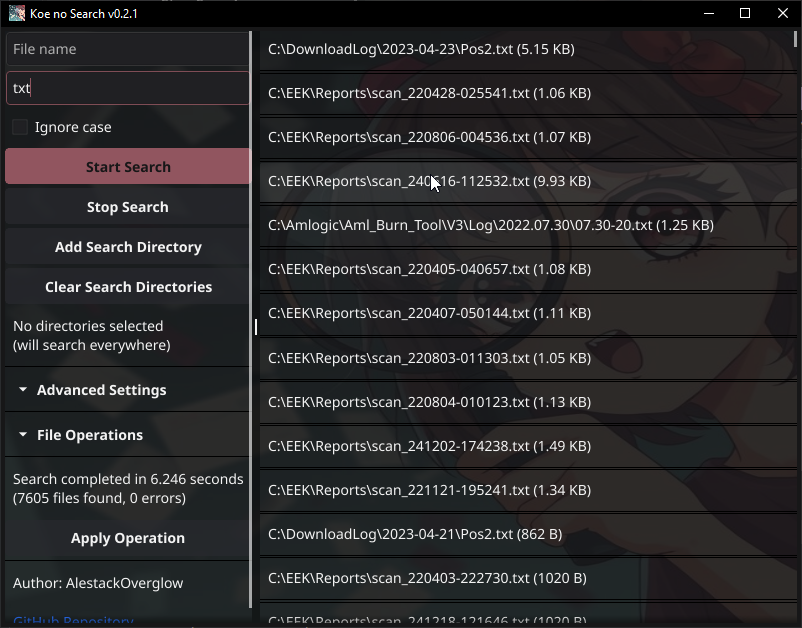

# Koe no Search

A high-performance file search utility with both GUI and CLI interfaces, designed to quickly find files across your system using various optimization techniques.



## Features

- 🚀 High-performance concurrent file search
- 🖥️ Modern GUI interface built with Fyne
- ⌨️ Command-line interface for scripting
- 🔍 Search by filename pattern or extension
- 🎯 Case-sensitive and case-insensitive search
- 📊 Adjustable worker threads and buffer sizes
- 💻 Cross-platform support (Windows, Linux, macOS)
- 📁 Multiple directory selection
- 🎨 File size formatting (B, KB, MB, GB)
- 🔄 Real-time results updates
- ⚡ Memory-mapped file handling for large files

## Performance Optimizations

### 1. Concurrent Processing
- Multiple worker goroutines for parallel file processing
- Configurable number of workers (default: number of CPU cores)
- Batch processing of files for reduced overhead

### 2. Memory Management
- Memory pooling for file buffers
- Memory-mapped files (mmap) for large file processing
- Aggressive garbage collection during search
- Buffer reuse for file content reading

### 3. File System Optimizations
- Directory caching for repeated searches
- Optimized directory walking
- Early file filtering before content processing
- Smart handling of symbolic links

### 4. Search Optimizations
- Quick pattern matching before regex
- Compiled regex patterns
- Case-folding optimization for case-insensitive search
- Priority-based file processing

## Installation

### Prerequisites
- Go 1.21 or later
- For GUI: A working graphics environment
- For development: Git

### Building from Source

1. Clone the repository:
   ```bash
   git clone https://github.com/yourusername/koe-no-search.git
   cd koe-no-search
   ```

2. Install dependencies:
   ```bash
   go mod download
   ```

3. Build the GUI version:
   ```bash
   # For Windows (without console window)
   go build -ldflags "-H windowsgui" -o koe-no-search-gui.exe ./cmd/gui

   # For Linux/macOS
   go build -o koe-no-search-gui ./cmd/gui
   ```

4. Build the CLI version:
   ```bash
   go build -o koe-no-search-cli ./cmd/cli
   ```

## Usage

### GUI Version

1. Launch the application:
   ```bash
   ./koe-no-search-gui
   ```

2. Interface elements:
   - **Pattern**: Enter the filename pattern to search for
   - **Extension**: Specify file extension (e.g., .txt, .go)
   - **Ignore case**: Toggle case-sensitive search
   - **Workers**: Adjust number of concurrent workers
   - **Buffer size**: Configure internal buffer size
   - **Add Directory**: Select directories to search
   - **Clear Directories**: Reset directory selection
   - **Start Search**: Begin the search operation
   - **Stop Search**: Cancel ongoing search
   - **Results List**: Double-click to open file location

### CLI Version

```bash
# Basic search
koe-no-search-cli -p "pattern" /path/to/search

# Search with specific extension
koe-no-search-cli -e ".txt" /path/to/search

# Case-insensitive search
koe-no-search-cli -i -p "Pattern" /path/to/search

# Configure workers
koe-no-search-cli -w 8 /path/to/search

# Multiple directories
koe-no-search-cli /path1 /path2 /path3
```

CLI Options:
- `-p, --pattern`: Search pattern
- `-e, --ext`: File extension
- `-i, --ignore-case`: Ignore case
- `-w, --workers`: Number of worker threads
- `-b, --buffer`: Buffer size

## Architecture

The project is structured into several key components:

```
koe-no-search/
├── cmd/
│   ├── cli/    # Command-line interface
│   └── gui/    # Graphical user interface
└── internal/
    └── search/ # Core search engine
        ├── cache.go     # File system caching
        ├── matcher.go   # Pattern matching
        ├── process.go   # File processing
        ├── walker.go    # Directory traversal
        └── types.go     # Data structures
```

## Contributing

1. Fork the repository
2. Create your feature branch (`git checkout -b feature/amazing-feature`)
3. Commit your changes (`git commit -m 'Add amazing feature'`)
4. Push to the branch (`git push origin feature/amazing-feature`)
5. Open a Pull Request

## License

This project is licensed under the MIT License - see the [LICENSE](LICENSE) file for details.

## Acknowledgments

- [Fyne](https://fyne.io/) for the GUI toolkit
- [xxHash](https://github.com/cespare/xxhash) for fast hashing
- [mmap-go](https://github.com/edsrzf/mmap-go) for memory mapping
- [cobra](https://github.com/spf13/cobra) for CLI interface 